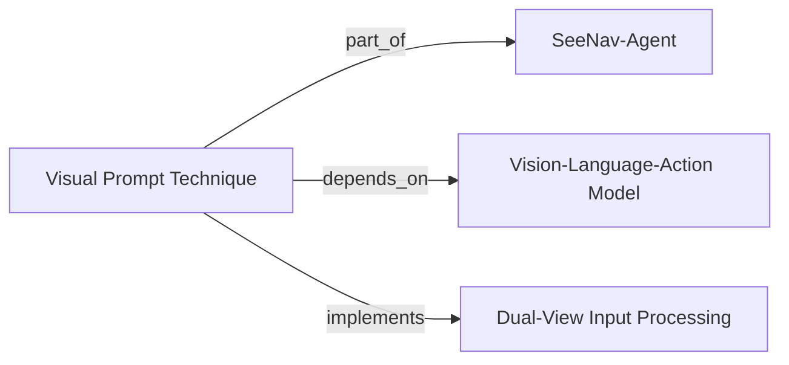

# Visual Prompt (VP) Technique

The **Visual Prompt (VP) technique** is a **dual-view visual prompt** algorithm designed to reduce **perception hallucinations** and improve **spatial understanding** in robotic navigation agents. It operates in a **zero-shot** manner, requiring no additional training or fine-tuning, and is a core component of the [[SeeNav-Agent]] system.

## Description

The Visual Prompt technique introduces a dual-view input representation that provides the agent with complementary spatial perspectives. By structuring the visual input as a prompt containing two distinct views, the agent gains a more robust understanding of its current spatial state, mitigating common failures caused by hallucinated or ambiguous perceptual cues. This technique is applied entirely at inference time, making it lightweight and broadly applicable.

## Parameters

| Parameter | Value |
|-----------|-------|
| Type | Dual-view visual prompt |
| Purpose | Reduce perception hallucinations, improve spatial understanding |

## Capabilities

- Achieves **zero-shot improvement** in navigation success rate across diverse environments.
- Enhances the agent's ability to reason about spatial layouts without additional training data.
- Integrates seamlessly into existing vision-language-action (VLA) models used by [[SeeNav-Agent]].

## Relationships

- **Part of**: [[SeeNav-Agent]] — the VP technique is a key algorithmic component of this navigation system.
- **Depends on**: [[Vision-Language-Action Model]] — the technique is applied on top of a VLA backbone to condition its spatial reasoning.
- **Implements**: Dual-view input processing — the core mechanism of combining two visual perspectives into a single prompt.

## See Also

- [[Perception Hallucination]] ⚠️ — the problem the VP technique addresses.
- [[Spatial Understanding]] ⚠️ — the capability improved by the VP technique.
- [[Zero-Shot Navigation]] — the paradigm within which VP operates.

### 自动链接关系
_These relationships were discovered automatically by the heuristic entity linker._
**Confirmed links:**
- `Visual Prompt (VP) technique` --[[extends]] ⚠️--> `SeeNav-Agent`
